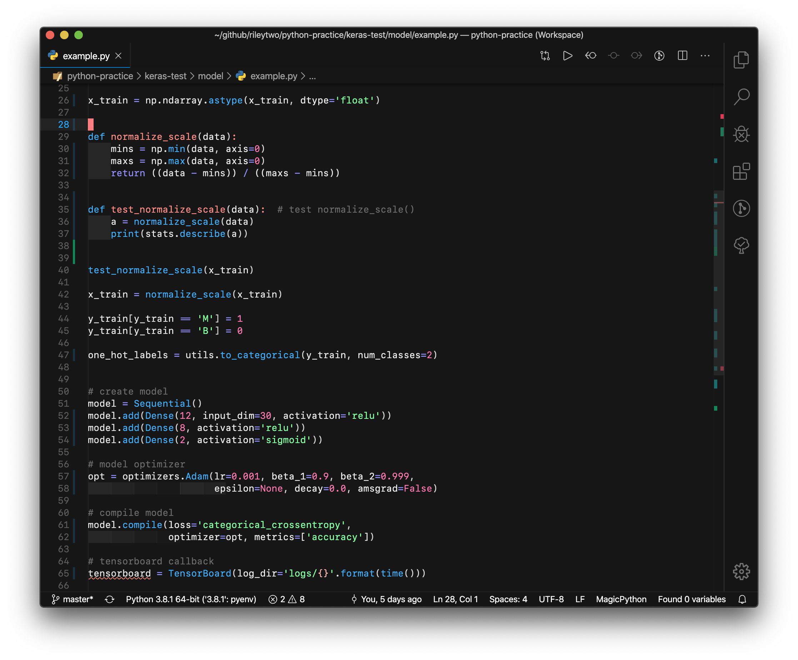
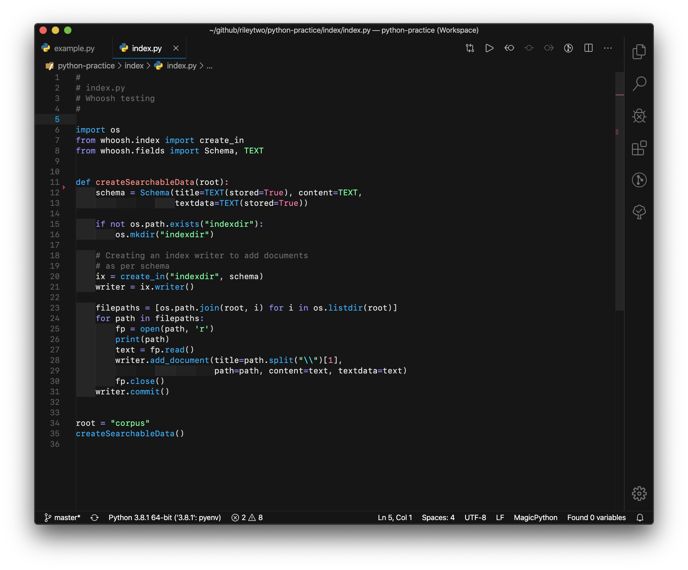
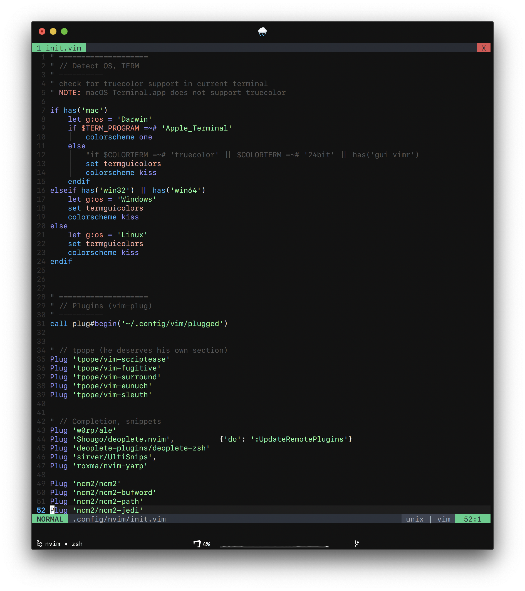
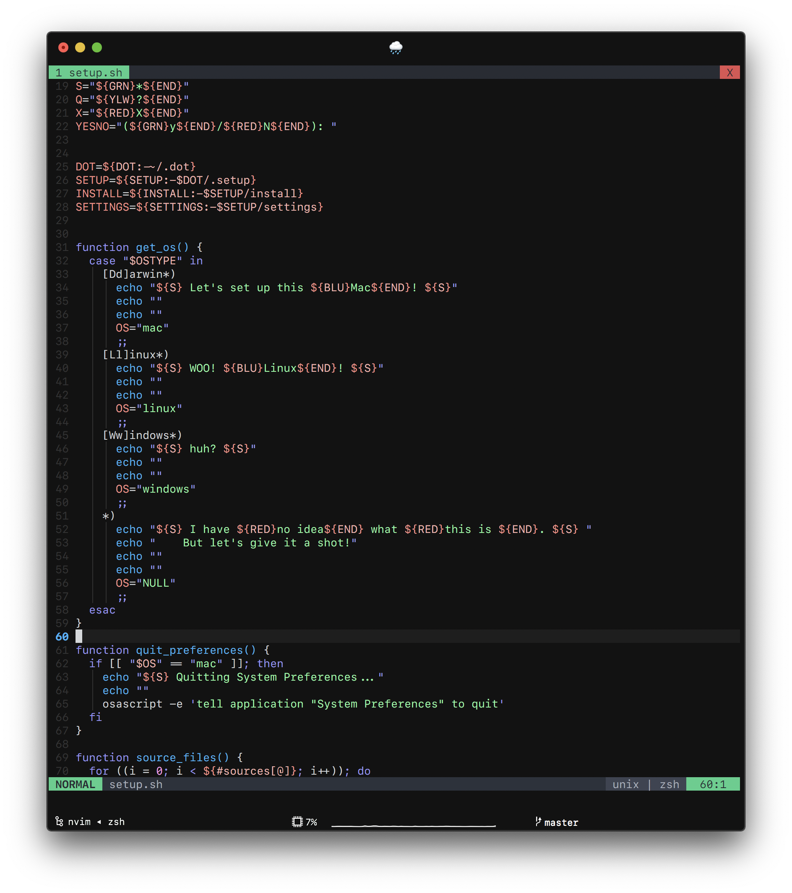
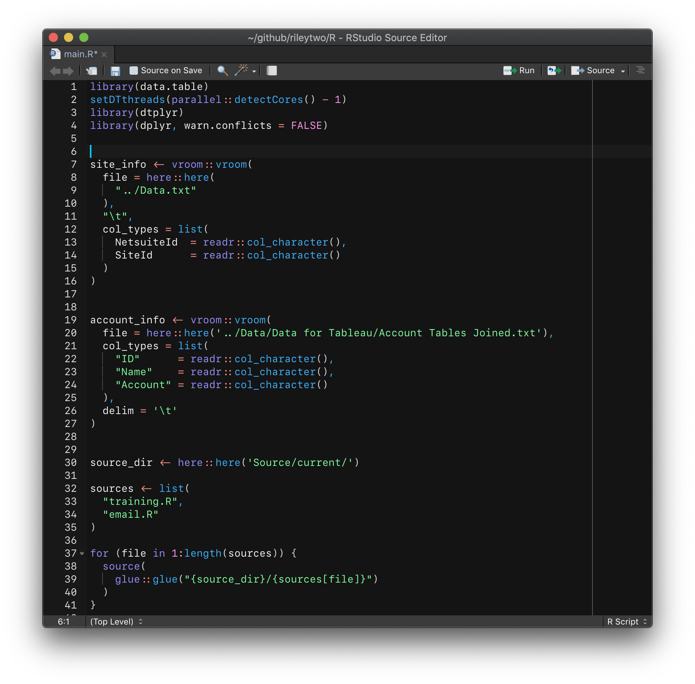
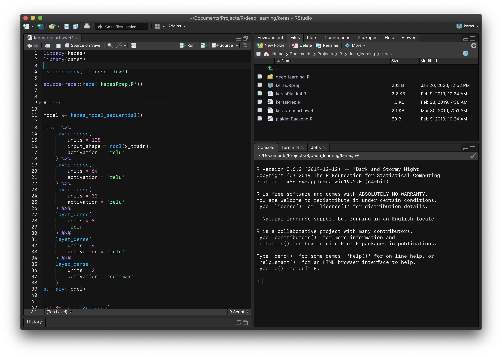
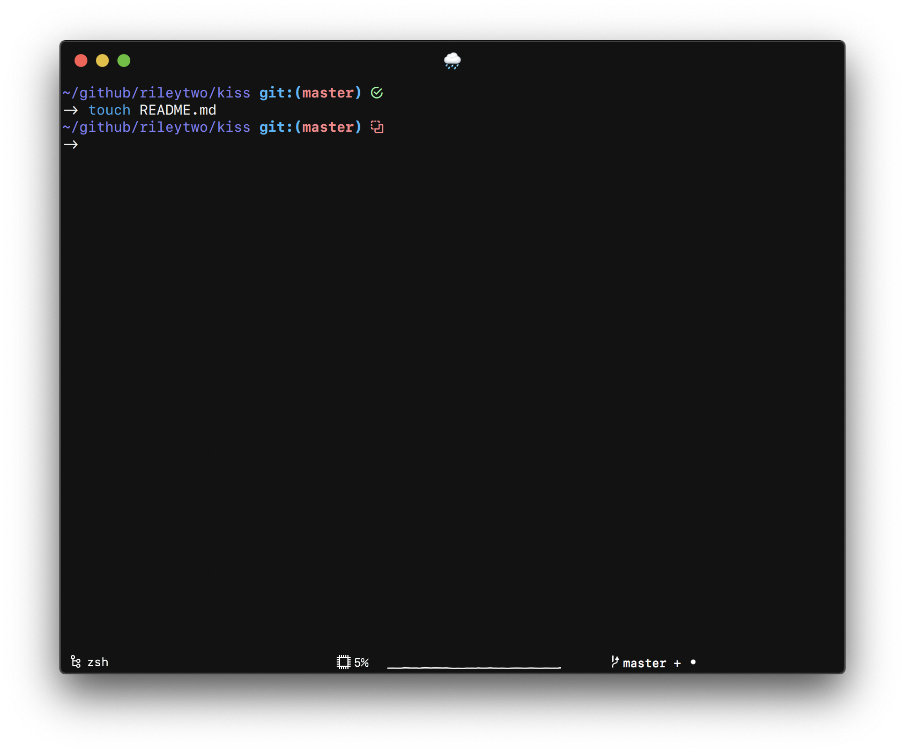

# Kiss: Keep It Simple, Stupid

A simple theme for VSCode, iTerm2, Neovim, RStudio, and Oh-My-Zsh![1](#Oh-My-Zsh).

## VSCode

## Neovim

## RStudio

Wondering why RStudio looks different? Check out my other project, [daRkStudio](https://github.com/rileytwo/daRkStudio)

## Oh-My-Zsh! Prompt

## Notes

<a name="Oh-My-Zsh">[1]</a>: The Oh-My-Zsh! theme only provides the shell prompt, and does not provide any colors. [↩](#omz-note)