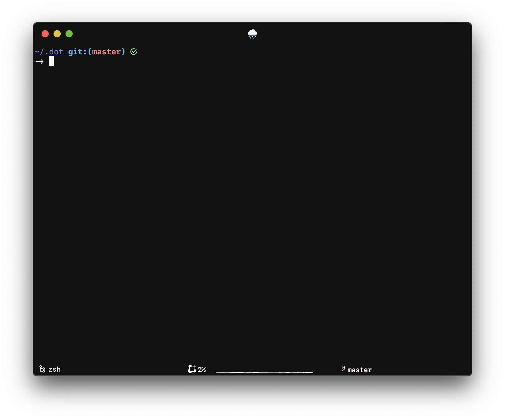

# Kiss: Keep It Stupid Simple

A simple theme for `VSCode`, `iTerm2`, `Neovim`, `RStudio`, and `Oh-My-Zsh!`[1](#Oh-My-Zsh).

## VSCode

## Neovim

## RStudio

Wondering why `RStudio` looks different? Check out my other project, [daRkStudio](https://github.com/rileytwo/daRkStudio). Or just install the R package: `remotes::install_github("rileytwo/darkstudio")`.

## Oh-My-Zsh! Prompt

## Notes

<a name="Oh-My-Zsh">[1]</a>: The Oh-My-Zsh! theme only provides the shell prompt, and does not provide any colors. [↩](#omz-note)